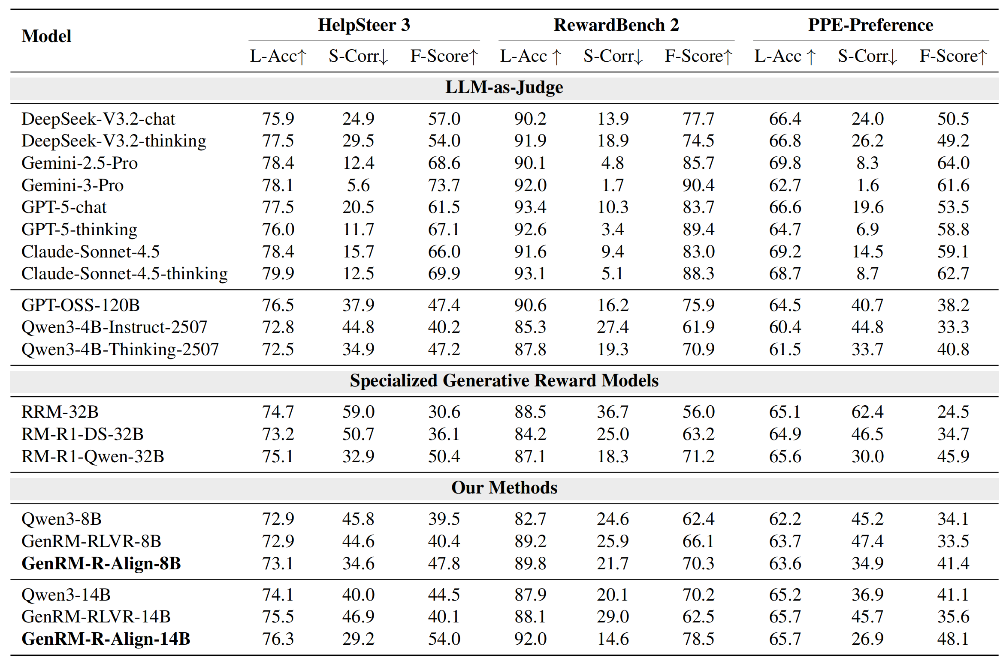
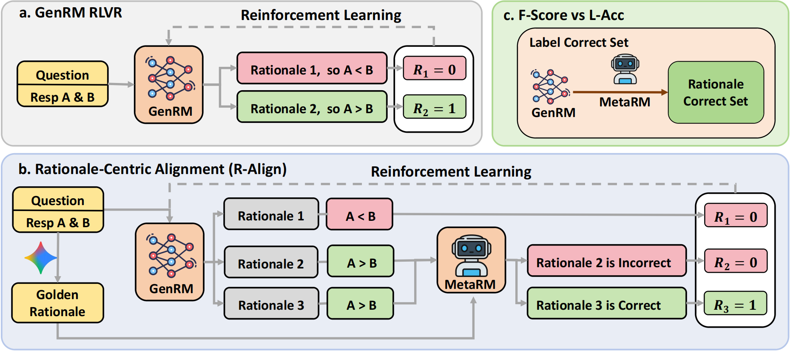
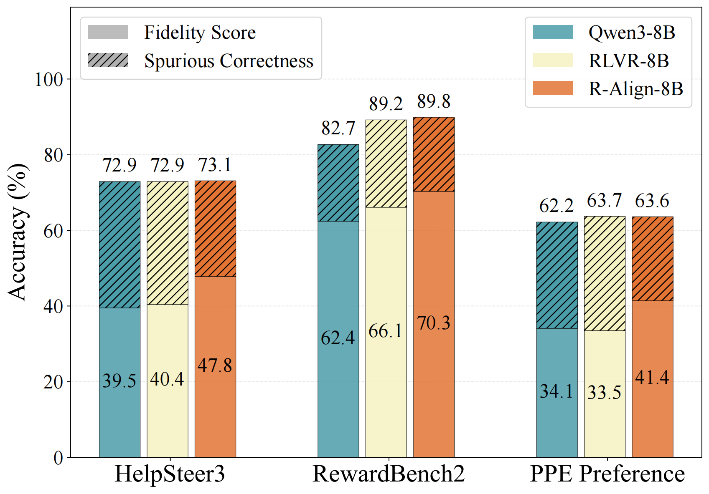
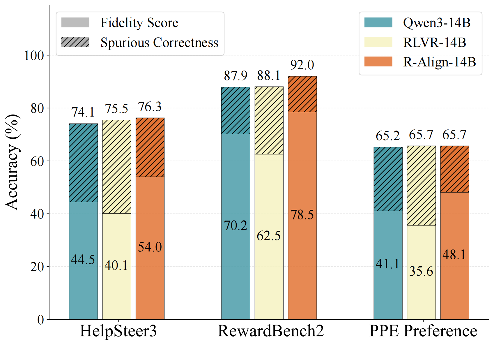
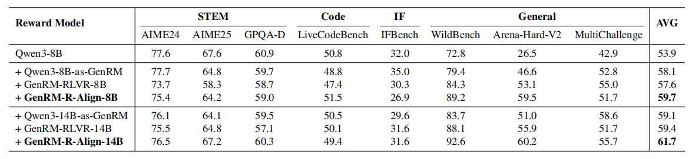
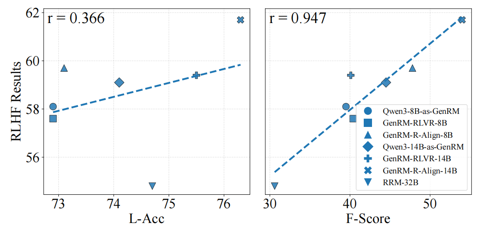

<div align="center">
  </div>

<h1 align="center"> R-Align: Enhancing Generative Reward Models through Rationale-Centric Meta-Judging </h1>

<div align="center">
  <a href="https://arxiv.org/abs/xxxx.xxxxx">
    
  </a>
  <a href="https://huggingface.co/papers/xxxx.xxxxx">
    
  </a>
  <a href="https://huggingface.co/collections/lyn22333/r-align">
    
  </a>
</div>

<h5 align="center"> If you find our work useful, please give us a star ⭐ on GitHub.</h5>

## 🌟 Highlights

- **🛑 Spurious Correctness:** We identify a critical pathology in GenRMs where models predict the correct preference label but for the wrong (spurious) reasons.
- **⚖️ Rationale-Aware Benchmark:** A new benchmark quantifying "S-Corr" (Spurious Correctness) using Golden Rationales generated by Gemini-3-Pro.
- **🎯 R-Align Framework:** A rationale-centric alignment method that utilizes Meta-Judging to enforce consistency between the rationale and the verdict, significantly improving downstream RLHF performance.

## 📦 Dataset & Models

We provide the **Rationale-Align GenRMs** and the **Downstream Policy** trained via R-Align, along with the datasets used for training and benchmarking.

### Models

| Model | Description | Link |
| :--- | :--- | :--- |
| **GenRM-R-Align-14B** | **Best GenRM**. Based on Qwen3-14B, trained with R-Align. | [🤗 HuggingFace](https://huggingface.co/lyn22333/GenRM-R-Align-14B) |
| **GenRM-R-Align-8B** | Efficient GenRM. Based on Qwen3-8B, trained with R-Align. | [🤗 HuggingFace](https://huggingface.co/lyn22333/GenRM-R-Align-8B) |
| **Policy-Qwen3-8B-R-Align-14B** | Downstream policy trained using GenRM-R-Align-14B via PPO. | [🤗 HuggingFace](https://huggingface.co/lyn22333/Policy-Qwen3-8B-R-Align-14B) |
| **Policy-Qwen3-8B-R-Align-8B** | Downstream policy trained using GenRM-R-Align-8B via PPO. | [🤗 HuggingFace](https://huggingface.co/lyn22333/Policy-Qwen3-8B-R-Align-8B) |


### Datasets

| Data | Description | Link |
| :--- | :--- | :--- |
| **Rationale-Aware Benchmark** | Eval data from HelpSteer3, RewardBench2, PPE with **Golden Rationales**. | [🤗 HuggingFace](https://huggingface.co/datasets/lyn22333/R-Align-BMK) |
| **R-Align Training Data** | Augmented Preference datasets with rationales. For GenRM RL training. | [🤗 HuggingFace](https://huggingface.co/datasets/lyn22333/R-Align-RL-Data) |

## 👀 Overview

**Spurious Correctness (S-Corr)** is a phenomenon where a GenRM predicts the correct preference label but justifies it with unsound reasoning (e.g., relying on formatting heuristics like bullet points instead of content quality).

<p align="center">
     <br>
  <i>Illustration of Spurious Correctness: The model chooses the correct response but for the wrong reason.</i>
</p>

To quantify this, we introduce the Rationale-Aware Benchmark. We augment standard datasets (HelpSteer3, RewardBench2, PPE-Preference) with Golden Rationales (generated by Gemini-3-Pro) to verify logical consistency. This allows us to measure Fidelity Score (F-Score): a strict metric requiring the model to be correct in both its final decision and its underlying rationale.

<div align="center"> 


<i>Comparison of Label Accuracy vs. Fidelity Score on our Rationale-Aware Benchmark.</i> </div>

To address this, we propose **R-Align (Rationale-Centric Alignment)**. Unlike standard RLVR which rewards only the final outcome, R-Align incorporates a **Meta-Judge** (MetaRM) to verify the logical consistency between the generated rationale and the golden reference.

<p align="center">
     <br>
  <i>Overview of the R-Align Framework.</i>
</p>

## 📊 Results

Our experiments show that **R-Align** significantly reduces Spurious Correctness (S-Corr) and improves the Fidelity Score (F-Score). Crucially, this improvement translates to better downstream RLHF performance.

<p align="center">
    
     <br>
  <i>Benchmark results on HelpSteer3, RewardBench2, and PPE-Preference (8B left, 14B right).</i>
</p>

### Downstream RLHF & Correlation

Beyond static benchmarks, **R-Align** drives superior downstream RLHF performance. It effectively mitigates the alignment tax in reasoning tasks (STEM/Code) while boosting general capabilities. 

Furthermore, our analysis confirms that **F-Score** is a robust predictor of RLHF outcomes ($r > 0.9$), whereas standard Label Accuracy shows weak correlation ($r \approx 0.3$), proving that rationale quality matters more than simple outcome correctness.

<p align="center">
   <br>
  <i>Downstream RLHF performance comparison across STEM, Code, and General domains.</i>
</p>

<div align="center">
   <br>
  <i>Correlation between GenRM metrics (L-Acc vs. F-Score) and downstream RLHF performance.</i>
</div>

## 🚀 Quick Start

This repository contains the **evaluation scripts** for the Rationale-Aware Benchmark. 


### Installation

```bash
git clone https://github.com/lyn22333/R-Align

cd R-Align

pip install -r requirements.txt

hf download lyn22333/R-Align-BMK --repo-type dataset --local-dir ./ --include "data/**"
```

### Run the Evaluation

```bash
# change the model names, api keys and base urls to your own
bash run.sh

python show_result.py
```